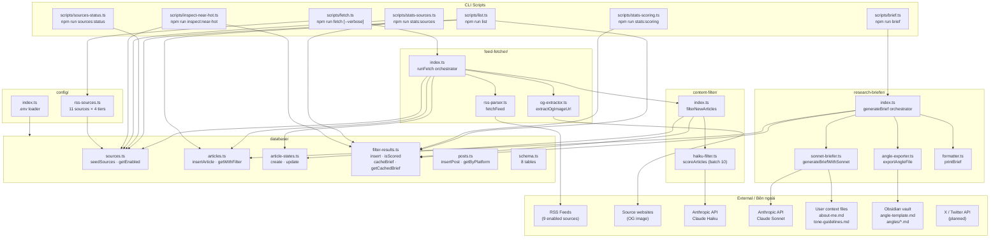
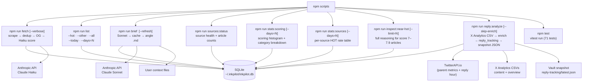
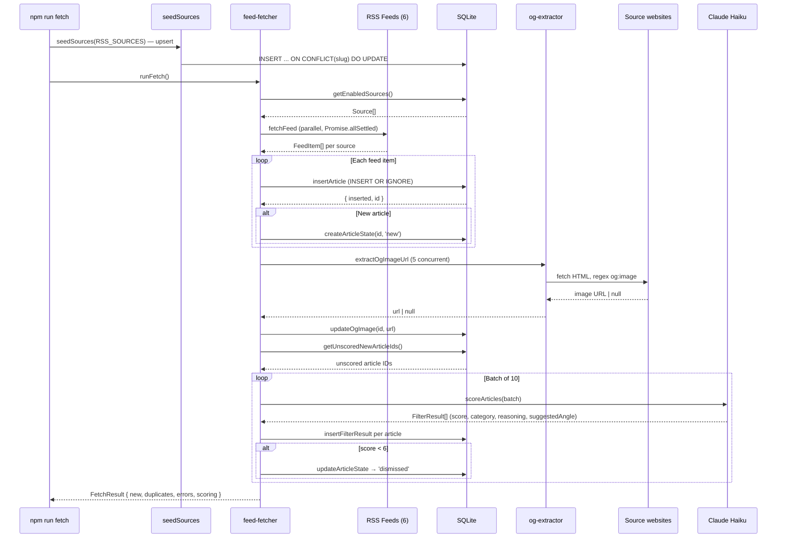
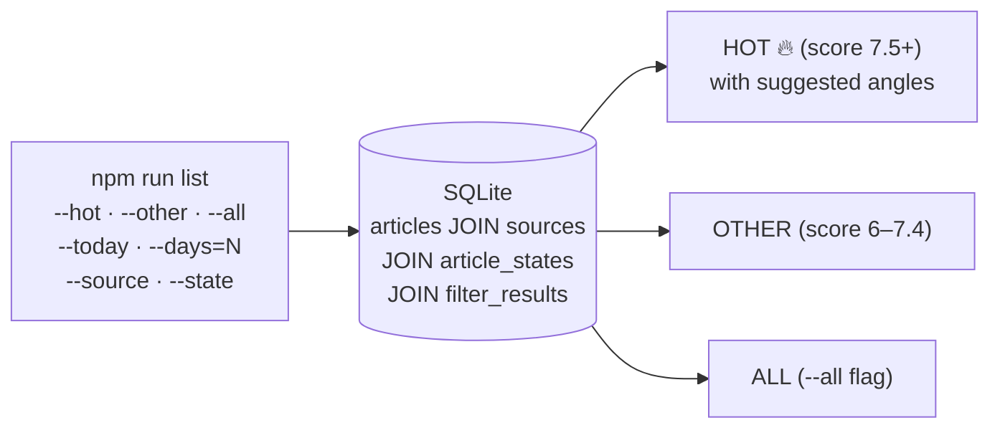
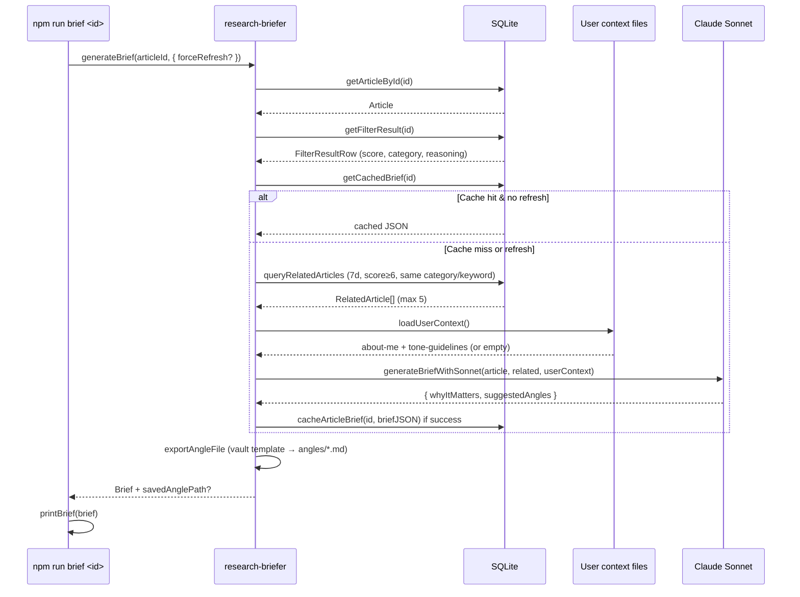

# InkPilot — PROJECT OVERVIEW
*Tổng quan dự án / Project overview (English–Vietnamese)*

---

## 1. Project Overview | Tổng quan dự án

**EN — What it does**
A **local-first CLI tool** for crypto content research. It **scrapes RSS feeds** from configurable sources (crypto, protocol, DeFi, AI, Vietnamese), **deduplicates by URL**, **extracts OG images**, and stores everything in a **SQLite database**. New articles are automatically **scored by Claude Haiku** (0–10, decimal) for relevance, with results surfaced in a **tiered inbox** (HOT 7.5+ / OTHER 6–7.4 / auto-dismissed < 6). Each article includes a **suggested angle** for writing personal takes. For any HOT article, the user can generate a **research brief via Claude Sonnet** — including WHY IT MATTERS, related stories, and bilingual suggested angles (Vietnamese primary + English) personalized to the user's voice and tone. The user **composes posts manually** and publishes to **X (Twitter)** — this is NOT an auto-posting bot.

**VI — Ứng dụng làm gì**
Công cụ **CLI local-first** phục vụ nghiên cứu nội dung crypto. Scrape **RSS** từ nhiều nguồn, **dedup theo URL**, **lấy ảnh OG**, lưu vào **SQLite**. Bài mới tự động được **Claude Haiku chấm điểm** (0–10, decimal) theo relevance, hiển thị trong **tiered inbox** (HOT 7.5+ / OTHER 6–7.4 / auto-dismissed < 6). Mỗi bài có **suggested angle** để viết take. Với bài HOT, user có thể generate **research brief qua Claude Sonnet** — bao gồm WHY IT MATTERS, bài liên quan, và suggested angles song ngữ (VN primary + EN) cá nhân hóa theo voice/tone của user. Người dùng **tự viết bài** rồi đăng lên **X (Twitter)** — đây KHÔNG phải bot tự động.

**EN — Target users**
Content creators and crypto researchers who want a **structured research pipeline** — automated feed collection, AI-powered relevance scoring, Sonnet-powered research briefs, manual curation, and human-written posts published to X.

**VI — Đối tượng**
Content creator và researcher crypto muốn **pipeline nghiên cứu có cấu trúc** — tự động thu thập feed, AI scoring, research brief bằng Sonnet, tự tay lọc bài, tự viết rồi đăng lên X.

---

## 2. Tech Stack | Công nghệ

| Layer / Lớp | EN | VI |
|-------------|----|----|
| **Runtime** | Node.js 20+, TypeScript 5.7, `tsx` | Node.js 20+, TypeScript 5.7, `tsx` |
| **Database** | SQLite via `better-sqlite3` (sync API, WAL mode) — 8 tables | SQLite qua `better-sqlite3` (sync API, WAL mode) — 8 bảng |
| **AI — Filter** | Anthropic SDK — Claude Haiku (`claude-haiku-4-5-20251001`): batch relevance scoring (10 articles/call), decimal scores | Anthropic SDK — Claude Haiku: chấm điểm hàng loạt (10 bài/call), điểm decimal |
| **AI — Brief** | Anthropic SDK — Claude Sonnet (`AI_MODELS.sonnet` → `claude-sonnet-4-6`): per-article brief, bilingual angles (strict hook-first prompts), cached | Anthropic SDK — Claude Sonnet: brief từng bài, song ngữ, có cache |
| **Model IDs** | `AI_MODELS` in `src/config/index.ts` — `haiku` + `sonnet` strings shared by Haiku filter and Sonnet briefer | `AI_MODELS` trong `src/config/index.ts` — cấu hình model tập trung |
| **Vault export** | After each `npm run brief`, fills `~/Dev/vault/templates/angle-template.md` (`__KEY__` placeholders) → writes `~/Dev/vault/projects/content-creator/angles/*.md` for Obsidian | Sau mỗi brief: điền template → ghi `.md` vào vault (Obsidian) |
| **RSS** | `rss-parser` — parallel multi-feed scraping with 10s timeout | `rss-parser` — scrape nhiều nguồn song song, timeout 10 giây |
| **OG Image** | Native `fetch` — extract `og:image` from HTML, 5s timeout | Native `fetch` — lấy `og:image` từ HTML, timeout 5 giây |
| **Config** | `dotenv` + `.env`; RSS sources as TS module (`rss-sources.ts`) | `dotenv` + `.env`; nguồn RSS trong TS module |
| **User Context** | Reads `about-me.md` + `tone-guidelines.md` from filesystem at runtime | Đọc `about-me.md` + `tone-guidelines.md` từ filesystem khi chạy |
| **Reply enrichment** | TwitterAPI.io via native `fetch` (`TWITTERAPI_IO_KEY`) — parent-tweet metrics + reply timestamp; CSV is the free base layer | TwitterAPI.io qua `fetch` (`TWITTERAPI_IO_KEY`) — metric tweet gốc + giờ reply; CSV là lớp nền free |
| **Publishing (planned)** | X (Twitter) API | X (Twitter) API |
| **Test** | Vitest — in-memory SQLite, mocked Anthropic SDK (Haiku + Sonnet) | Vitest — SQLite in-memory, mock Anthropic SDK (Haiku + Sonnet) |
| **Dev** | ESLint 9, `@typescript-eslint`, strict TypeScript | ESLint 9, `@typescript-eslint`, strict TypeScript |

---

## 3. Core Features | Tính năng chính

| EN | VI |
|----|----|
| **Multi-source RSS scraping** — parallel fetch via `Promise.allSettled`, 16 configurable sources (9 enabled) across 4 tiers, 10s timeout per feed; one feed failure doesn't crash the rest. | **Scrape RSS nhiều nguồn** — fetch song song qua `Promise.allSettled`, 16 nguồn (9 enabled) chia 4 tier, timeout 10 giây; lỗi 1 feed không ảnh hưởng các feed khác. |
| **AI relevance filter (Haiku)** — batch up to 10 articles per call, decimal scores 0–10 (e.g. 7.2, 8.5), 12 fixed categories (L2, DeFi, AI x Crypto, Developer Tooling, SocialFi, Bitcoin, Regulation, Macro, Research/Protocol, Price/Trading, Exchange/Corporate, Other), reasoning + suggested angle; drops below 6 → auto-dismissed. | **Lọc AI (Haiku)** — batch tới 10 bài/call, điểm decimal 0–10, 12 category cố định, reasoning + suggested angle; dưới 6 → auto-dismissed. |
| **Tiered inbox** — HOT (7.5+) shown by default with suggested angles, OTHER (6–7.4) via `--other`, dismissed hidden; `--all` to show everything. Recency filter: 30 days default, `--days=N` to override. | **Tiered inbox** — HOT (7.5+) hiện mặc định với suggested angle, OTHER (6–7.4) qua `--other`, dismissed ẩn; `--all` hiện tất cả. Recency filter: 30 ngày mặc định, `--days=N` để override. |
| **Research brief (Sonnet)** — `npm run brief <id>` generates: WHY IT MATTERS (2–3 sentences), related stories (last 7 days, score ≥ 6), suggested angles (VN primary + EN). Personalized via user context files. Cached in DB — second run skips API. | **Research brief (Sonnet)** — `npm run brief <id>` tạo: WHY IT MATTERS (2–3 câu), bài liên quan (7 ngày, score ≥ 6), suggested angles (VN chính + EN). Cá nhân hóa qua user context files. Cache trong DB — lần 2 không gọi API. |
| **URL dedup** — `INSERT OR IGNORE` on UNIQUE url constraint; second fetch of same articles silently skipped. | **Dedup theo URL** — `INSERT OR IGNORE` trên constraint UNIQUE; fetch lại không tạo bản trùng. |
| **OG image extraction** — fetches article HTML, regex-extracts `og:image` meta tag; max 5 concurrent requests; never throws. | **Lấy ảnh OG** — fetch HTML bài viết, regex lấy `og:image`; tối đa 5 request song song; không throw. |
| **Article state machine** — `new` → `read` → `starred` → `drafted` → `posted` → `dismissed`; each article gets a state row on insert. | **State machine bài viết** — `new` → `read` → `starred` → `drafted` → `posted` → `dismissed`; mỗi bài có state row khi insert. |
| **Source upsert** — `seedSources()` uses `ON CONFLICT(slug) DO UPDATE`; config changes to URL, enabled, tier auto-sync to DB. | **Upsert nguồn** — `seedSources()` dùng `ON CONFLICT(slug) DO UPDATE`; thay đổi URL, enabled, tier tự sync vào DB. |
| **Idempotent scoring** — articles already in `filter_results` are never re-scored; previously unscored articles are picked up on next fetch. | **Scoring idempotent** — bài đã có `filter_results` không score lại; bài chưa score được lấy ở lần fetch sau. |
| **Brief cache** — Sonnet brief serialized as JSON in `filter_results.ai_context`; second `npm run brief` returns cached result without API call; `--refresh` skips cache and overwrites. | **Cache brief** — JSON trong `filter_results.ai_context`; lần 2 không gọi Sonnet; `--refresh` bỏ qua cache. |
| **Angle markdown export** — `angle-exporter.ts` reads template with `__KEY__` placeholders (Obsidian-safe; no `{{}}` in YAML), writes `YYYY-MM-DD-<articleId>-<slug>.md`; missing template logs warning only. | **Export angle .md** — template `__KEY__`, ghi file theo ngày + id + slug; thiếu template chỉ warn. |
| **Cost tracking** — Haiku + Sonnet token usage (input/output) and USD estimate per operation. | **Theo dõi chi phí** — đếm token Haiku + Sonnet (in/out) và ước tính USD mỗi lần chạy. |
| **Source status** — `npm run sources:status` prints per-source table: enabled/disabled, article count, last article date, last fetch timestamp; no API key required. | **Trạng thái nguồn** — `npm run sources:status` in bảng per-source: enabled/disabled, số bài, ngày bài gần nhất, lần fetch cuối; không cần API key. |
| **Verbose fetch** — `npm run fetch -- --verbose` logs per-feed item count + new/dup breakdown after each source; default output unchanged. | **Fetch verbose** — `npm run fetch -- --verbose` log per-feed số item + new/dup sau mỗi nguồn; output mặc định không đổi. |
| **Scoring diagnostic** — `npm run stats:scoring [--days=N]` prints total scored / HOT / OTHER / dismissed with percentages, avg score, 8-bucket histogram (split at 7.5) with bar chart, and Haiku-assigned category breakdown. Read-only, no API key needed. | **Diagnostic scoring** — `npm run stats:scoring [--days=N]` in tổng số, tỉ lệ HOT/OTHER/dismissed, histogram 8 bucket (chia tại 7.5), breakdown theo Haiku category. Chỉ đọc, không cần API key. |
| **Per-source diagnostic** — `npm run stats:sources [--days=N]` prints per-source table: total scored, avg score, HOT / OTHER / dismissed counts, HOT% rate. Ordered by HOT count then avg score. | **Diagnostic per nguồn** — `npm run stats:sources [--days=N]` in bảng per-source: số bài scored, avg score, HOT/OTHER/dismissed, HOT%. Sắp xếp theo HOT rồi avg score. |
| **Near-HOT inspector** — `npm run inspect:near-hot [--limit=N] [--days=N]` lists articles scoring 7.0–7.4 with full untruncated Haiku reasoning and suggested angle; use to diagnose whether the 7.5 HOT threshold needs adjustment. | **Inspect near-HOT** — `npm run inspect:near-hot` liệt kê bài score 7–7.4 với full Haiku reasoning và suggested angle; dùng để kiểm tra threshold 7.5 có phù hợp không. |
| **Reply tracking (X analytics)** — `npm run reply:analyze` reads two X Analytics CSV exports, classifies KOL replies vs originals (reply = post text starts with `@`), looks up each KOL's niche (`security\|tokenomics\|l1l2\|other`), enriches each reply via TwitterAPI.io (reply hour-of-day + parent-tweet impressions/engagements as a wave-size proxy), accumulates history in `reply_tracking` (idempotent on reply Post id), and writes a fixed-schema JSON snapshot to the vault for the Newsroom dashboard. `--skip-enrich` runs CSV-only (no API spend); `--content=`/`--overview=` override paths. | **Reply tracking (X analytics)** — `npm run reply:analyze` đọc 2 file CSV X Analytics, phân loại reply KOL vs original (reply = text bắt đầu `@`), tra niche từng KOL, enrich qua TwitterAPI.io (giờ reply + imp/eng tweet gốc làm proxy độ hot), tích lũy vào `reply_tracking` (idempotent theo Post id), ghi snapshot JSON cố định schema ra vault cho dashboard Newsroom. `--skip-enrich` chạy CSV-only; `--content=`/`--overview=` override path. |

**EN — Not yet built (planned slices):** X API posting adapter (Slice 5), TUI / Ink (Slice 6+), realtime Reply Monitor (builds on the `reply_tracking` data layer).
**VI — Chưa xây (slice sắp tới):** X API posting adapter (Slice 5), TUI / Ink (Slice 6+), Reply Monitor realtime (dựa trên lớp dữ liệu `reply_tracking`).

---

## 4. Architecture | Kiến trúc

### 4.1 Mermaid — High-level architecture | Kiến trúc tổng thể



### 4.2 Mermaid — CLI entry points | Các điểm vào CLI



### 4.3 Module notes

- **Sync DB, async HTTP + AI:** `better-sqlite3` is synchronous (no `await` on DB calls); all `async/await` is limited to HTTP fetching (RSS, OG extraction) and Anthropic API calls (Haiku + Sonnet).

- **Graceful degradation:** `Promise.allSettled` for feed fetching — each source is independent. OG extractor never throws. Haiku API failure → articles keep state `new`, scored on next fetch. Sonnet API failure → partial brief returned with empty angles.

- **Batch scoring:** Haiku receives up to 10 articles per call with title + snippet. Response is JSON array with decimal score, category, reasoning, suggestedAngle. Malformed response → fallback score 5.

- **Research brief:** Sonnet receives single article context + related articles + user context (about-me + tone-guidelines). Response is JSON with whyItMatters + suggestedAngles (VN + EN; strict angle rules — hook first, no news recap). Result cached in `filter_results.ai_context` — second call returns from cache unless `--refresh`. After every brief, `exportAngleFile` fills the vault template (`__KEY__` placeholders) and writes a markdown file under `~/Dev/vault/projects/content-creator/angles/`.

- **Concurrency control:** RSS feeds fetched in full parallel; OG image extraction limited to 5 concurrent; Haiku batches run sequentially (to avoid rate limits); Sonnet briefs are single-article calls.

- **Schema migration:** `migrations.ts` detects old tables and drops/recreates — safe because sources are re-seeded and scoring is idempotent.

- **Reply tracking (hybrid CSV + API):** `runReplyAnalyze` treats the X Analytics CSV as the free base layer (reply impressions/engagements/follows come straight from it). TwitterAPI.io is called only to fill what the CSV lacks — the reply's hour-of-day and the parent tweet's cumulative impressions/engagements (a wave-size proxy, not a realtime number). Enrichment is one-pass: only rows with `enriched_at IS NULL` call the API, so re-runs are cheap and idempotent. Per-reply API failures are caught, counted, and skipped — the run never aborts. All snapshot aggregation reads back from the DB after upsert, so the JSON is reproducible; `weeklyTrend` spans all accumulated rows while every other section reflects the current CSV's period. The live TwitterAPI.io JSON shape is an assumption isolated in `enricher.ts` (`mapTweet`/`fetchTweet`, flagged `// VERIFY`).

---

## 5. Key Files / Modules | File và module quan trọng

| Path | EN (role) | VI (vai trò) |
|------|-----------|--------------|
| `src/scripts/fetch.ts` | CLI entry: seed sources → scrape RSS → insert → OG → Haiku score → cost summary; `--verbose` flag logs per-source item/new/dup counts | CLI: seed → scrape → insert → OG → score → chi phí; `--verbose` log per-source |
| `src/scripts/list.ts` | CLI entry: tiered inbox (HOT/OTHER), `--hot`, `--other`, `--all`, `--today`, `--days=N`, `--source`, `--state`; footer shows `"X of Y"` total count when limit is hit; condition building shared via `buildArticleConditions` + `countScoredArticles` | CLI list: tiered inbox, filter đa dạng, recency filter, total count trong footer |
| `src/scripts/brief.ts` | CLI: `npm run brief <id> [--refresh]` → load → cache? → Sonnet? → cache DB → export angle `.md` → print | CLI brief + refresh + export vault |
| `src/scripts/sources-status.ts` | CLI: `npm run sources:status` — init DB → seed → `getSourcesStatus()` → print aligned table (name, enabled, article count, last article date, last fetch) | CLI trạng thái nguồn — bảng per-source, không cần API key |
| `src/scripts/stats-scoring.ts` | CLI: `npm run stats:scoring [--days=N]` — 8-bucket histogram (split at `SCORE_THRESHOLDS.HOT = 7.5`; buckets: `7–7.5` near-HOT, `7.5–8` ← HOT) + HOT/OTHER/dismissed totals + avg score; second query for Haiku-assigned category breakdown; read-only, no API key | CLI diagnostic scoring: histogram 8 bucket, tỉ lệ, category breakdown |
| `src/scripts/stats-sources.ts` | CLI: `npm run stats:sources [--days=N]` — JOIN `filter_results → articles → sources`, GROUP BY `source_id`, ordered by HOT count then avg score; `✓` marks sources with ≥1 HOT article; totals row at footer | CLI diagnostic per-source: HOT rate, avg score, counts |
| `src/scripts/inspect-near-hot.ts` | CLI: `npm run inspect:near-hot [--limit=N] [--days=N]` — queries `score >= 7.0 AND score < 7.5` (below HOT threshold), JOIN sources; prints full `reasoning` + `suggested_angle` untruncated per article | CLI inspector: near-HOT articles + full Haiku reasoning |
| `src/scripts/reply-analyze.ts` | CLI: `npm run reply:analyze [--skip-enrich] [--content=PATH] [--overview=PATH]` — guards `TWITTERAPI_IO_KEY` (unless skip), runs `runReplyAnalyze`, prints summary + top KOLs + by-niche | CLI reply tracking: enrich + snapshot, in summary |
| `src/reply-tracking/index.ts` | `runReplyAnalyze` orchestrator: parse CSV → upsert replies (niche via `lookupNiche`) → enrich un-enriched rows (per-reply try/catch) → `buildSnapshot` → `exportSnapshot`; `enrichFn`/`exportFn` injectable for tests, `db?` for in-memory tests | Orchestrator reply: parse → upsert → enrich → snapshot |
| `src/reply-tracking/csv-parser.ts` | `parseCsv` (RFC-4180), `parseContentCsv`/`parseOverviewCsv` (header-name indexed), `parseXDate` (`Sun, Jun 7, 2026` → ISO), `extractKolHandle` (reply detection), `derivePeriod` | Parser CSV X Analytics + detect reply |
| `src/reply-tracking/snapshot-builder.ts` | Pure `buildSnapshot` → Newsroom contract (summary, byKol sorted, byNiche×4, byHour, parentSizeCorrelation, weeklyTrend from all rows); `weekStart`, `nowIsoPlus7` | Build snapshot JSON (pure) |
| `src/reply-tracking/enricher.ts` | `enrichReply` (TwitterAPI.io: reply tweet → parent metrics + hour); pure `mapTweet`/`computeHourPlus7`. Live API field mapping isolated here (flagged `// VERIFY`) | Enrich qua TwitterAPI.io |
| `src/reply-tracking/exporter.ts` | `exportSnapshot` → writes `~/Dev/vault/projects/content-creator/analytics/reply-tracking/latest.json` | Ghi snapshot ra vault |
| `src/reply-tracking/types.ts` | `ContentRow`, `OverviewRow`, `Period`, `ReplyEnrichment`, `EnrichFn`, `ReplySnapshot` + section types | Types module reply-tracking |
| `src/config/kol-niches.ts` | `KOL_NICHES` handle→niche map (synced by hand from vault `kol-reply-list.md`), `NICHES`, `lookupNiche` (unknown → `other`) | Map KOL→niche (sync tay từ vault) |
| `src/database/reply-tracking.ts` | `upsertReply` (idempotent on `post_id`, preserves enrichment cols), `updateReplyEnrichment`, `getRepliesNeedingEnrichment`, `getRepliesInPeriod`, `getAllReplies` | CRUD bảng reply_tracking |
| `src/config/index.ts` | Loads `.env` → exports typed `Config`; exports `AI_MODELS` (Haiku + Sonnet API model IDs), `SCORE_THRESHOLDS` (`HOT = 7.5`, `OTHER_MIN = 6.0`), `REPLY_THRESHOLDS` (`DUD_IMPRESSIONS = 50`), and `requireTwitterApiIoKey()` | Load `.env` + `AI_MODELS` + `SCORE_THRESHOLDS` + `REPLY_THRESHOLDS` + TwitterAPI.io key guard |
| `src/config/types.ts` | `Config` interface | Interface `Config` |
| `src/config/rss-sources.ts` | Source of truth for all RSS feeds: 16 sources × 4 tiers, typed `RssSourceConfig[]`; optional `articleDomain?: string` for sources where feed host ≠ article URL host (e.g. Vitalik: feed at `vitalik.eth.limo`, articles at `vitalik.ca`) | Danh sách RSS: 16 nguồn × 4 tier; `articleDomain` override khi feed host ≠ article host |
| `src/content-filter/index.ts` | `filterNewArticles` orchestrator: load articles → batch → score → insert results → update states | Orchestrator scoring: load → batch → score → insert → update state |
| `src/content-filter/haiku-filter.ts` | `scoreArticles`: Anthropic SDK call, JSON parse, fallback on error, cost calculation | Gọi Anthropic SDK, parse JSON, fallback khi lỗi, tính chi phí |
| `src/content-filter/types.ts` | `ArticleToScore`, `FilterResult`, `BatchFilterResult` | Types cho content filter |
| `src/research-briefer/index.ts` | `generateBrief` orchestrator: load → cache? → related → user context → Sonnet → cache DB → `exportAngleFile` | Orchestrator brief + export angle |
| `src/research-briefer/sonnet-briefer.ts` | `generateBriefWithSonnet`: Sonnet API call, `loadUserContext`, JSON parse, cost calculation | Gọi Sonnet API, load user context, parse JSON, tính chi phí |
| `src/research-briefer/angle-exporter.ts` | `exportAngleFile`: read `~/Dev/vault/templates/angle-template.md`, replace `__KEY__`, write `angles/YYYY-MM-DD-<id>-<slug>.md` | Điền template → ghi file Obsidian |
| `src/research-briefer/formatter.ts` | `printBrief`: terminal output + optional `💾 Saved:` path | Hiển thị brief + đường dẫn file angle |
| `src/research-briefer/types.ts` | `Brief`, `RelatedArticle`, `SuggestedAngles` | Types cho research briefer |
| `src/database/schema.ts` | `CREATE TABLE` for all 8 tables + indexes | Schema 8 bảng + index |
| `src/database/index.ts` | Singleton DB connection (`initDb`/`getDb`/`closeDb`/`resetDb`); WAL mode, foreign keys | Kết nối DB singleton; WAL mode |
| `src/database/migrations.ts` | Runs schema; auto-migrates old `sources` and `filter_results` tables | Chạy schema; tự migrate bảng cũ |
| `src/database/sources.ts` | `seedSources` (upsert), `getEnabledSources`, `getSourceBySlug`, `updateLastFetchedAt`, `getSourcesStatus`, `repairArticleSourceIds` (re-maps `articles.source_id` by URL domain after migrations that reset auto-increment IDs) | CRUD bảng sources (upsert) + status query + repair |
| `src/database/articles.ts` | `insertArticle` (dedup), `getArticlesWithFilter` (flexible JOIN query), `updateOgImage` | CRUD bảng articles |
| `src/database/article-states.ts` | `createArticleState`, `updateArticleState`, `getArticleState` | CRUD bảng article_states |
| `src/database/filter-results.ts` | `insertFilterResult`, `isArticleScored`, `getUnscoredArticleIds`, `cacheArticleBrief`, `getCachedBrief` | CRUD bảng filter_results + cache brief |
| `src/database/posts.ts` | `insertPost`, `getPostById`, `getPostsByPlatform`, `countTodayPosts` | CRUD bảng posts |
| `src/database/types.ts` | Shared types: `ArticleState`, `Source`, `Article`, `ArticleStateRow` | Types dùng chung |
| `src/feed-fetcher/index.ts` | `runFetch` orchestrator: parallel feeds → dedup → OG → scoring → `FetchResult` | Orchestrator: fetch → dedup → OG → scoring |
| `src/feed-fetcher/rss-parser.ts` | `fetchFeed(url)` → `FeedItem[]`; 10s timeout, HTML tag stripping | Parse RSS feed, timeout 10 giây |
| `src/feed-fetcher/og-extractor.ts` | `extractOgImageUrl(url)` → `string \| null`; 5s timeout, never throws | Lấy og:image, timeout 5 giây, không throw |
| `src/utils/logger.ts` | `createLogger(context)` — leveled (`debug`/`info`/`warn`/`error`), colored, timestamped | Logger có màu, theo cấp độ |
| `.env.example` | Env template: `ANTHROPIC_API_KEY`, `DB_PATH`, `LOG_LEVEL`, `TWITTERAPI_IO_KEY` | Template biến môi trường |
| `tests/database.test.ts` | 8 tests: schema init, posts CRUD (platform `x`) | 8 test: schema, posts CRUD |
| `tests/feed-fetcher.test.ts` | 14 tests: sources seeding, article dedup, article states, mocked runFetch | 14 test: seed nguồn, dedup, states, mock fetch |
| `tests/content-filter.test.ts` | 10 tests: filter DB CRUD, scoring + state transitions, mocked Anthropic, fallback, cost calc | 10 test: filter DB, scoring, mock Anthropic, fallback |
| `tests/research-briefer.test.ts` | 7 tests: brief cache, related articles query, mocked Sonnet, API failure fallback, user context fallback, cost calc | 7 test: cache, related, mock Sonnet, fallback, cost |
| `tests/reply-tracking.test.ts` | 32 tests: KOL niche lookup, CSV parser (RFC-4180, date, reply detection, pipeline), DB idempotency + enrichment preservation, snapshot builder (all sections), enricher helpers, orchestrator (replies-only, idempotent enrich, per-reply failure isolation, missing-CSV handling) | 32 test: niche, CSV, DB idempotent, snapshot, enricher, orchestrator |
| `templates/angle-template.md` | Repo copy of vault template (`__KEY__` placeholders); copy to `~/Dev/vault/templates/angle-template.md` | Template góc — copy vào vault |

---

## 6. Data Flow | Luồng dữ liệu

### 6.1 Fetch pipeline: RSS → Haiku → SQLite



### 6.2 List: SQLite → Tiered Inbox



### 6.3 Brief: Article → Sonnet → Cache



---

## 7. Database Schema | Schema cơ sở dữ liệu

```
sources          — 16 RSS feeds, upserted from config (slug UNIQUE, name, url, category, tier, language, enabled)
articles         — fetched articles (url UNIQUE, title, content, author, published_at, og_image_url)
article_states   — state machine per article (new → read → starred → drafted → posted → dismissed)
filter_results   — Haiku scoring + Sonnet brief cache (article_id UNIQUE, score, category, reasoning, suggested_angle, ai_context for cached brief, tokens, model)
drafts           — AI-generated drafts (planned — Slice 5)
posts            — published posts to X (planned — Slice 5)
post_metrics     — engagement metrics (planned — Slice 5+)
reply_tracking   — KOL-reply analytics, accumulated across weeks (post_id UNIQUE = reply tweet id; posted_date, kol_handle, niche, impressions/engagements/new_follows from CSV; parent_impressions/parent_engagements/reply_created_at/hour from TwitterAPI.io enrichment; enriched_at gates re-enrichment)
```

---

## 8. RSS Sources | Nguồn RSS

| Tier | Nguồn | Category | Language | Interval | Status |
|------|-------|----------|----------|----------|--------|
| 1 | Decrypt, Bankless, CoinDesk, Blockworks | crypto / defi | en | 1h | enabled |
| 1 | ETH Research Forum, Bitcoin Optech | research-technical | en | 1h | enabled |
| 1 | The Block | crypto | en | 1h | **disabled** — Cloudflare blocks all non-browser requests (HTTP 403) |
| 2 | Ethereum Foundation Blog, Arbitrum Foundation | protocol / protocol-l2 | en | 1h | enabled |
| 2 | Base Blog | protocol | en | 1h | **disabled** — `base.mirror.xyz` dead; `blog.base.org` Cloudflare JS challenge |
| 2 | Optimism Blog | protocol-l2 | en | 1h | **disabled** — `optimism.mirror.xyz` + all Paragraph alternatives stale since Jun 2025 |
| 2 | Vitalik's Blog | protocol | en | 1h | **disabled** — retained for FK integrity (171 articles in DB) |
| 3 | CoinCu News | vietnamese | vi | 2h | enabled |
| 3 | Coin68, Tạp Chí Bitcoin | vietnamese | vi | 2h | **disabled** — retained for FK integrity |
| 4 | MarkTechPost | ai | en | 2h | **disabled** — retained for FK integrity (10 articles in DB) |

---

## 9. AI Systems | Hệ thống AI

### 9.1 Haiku Scoring — Relevance filter

Niche priority stack (weighted by creator's content focus):

| Priority | Niche | Topics |
|----------|-------|--------|
| **PRIMARY (~50%)** | Security | Hacks, exploits, bridge attacks, post-mortems; smart contract vulnerabilities, audit findings; wallet security, phishing, social engineering; bug bounties, formal verification, ZK proof vulnerabilities |
| **SECONDARY (~30%)** | Tokenomics | Token design, emission schedules, vesting cliff analysis; liquid staking (Lido, EtherFi, Rocket Pool), restaking (EigenLayer, Symbiotic); protocol revenue, fee mechanisms (EIP-1559, burn, fee switches); treasury management, DAO funding, buy-backs; airdrop design critique |
| **TERTIARY (~20%)** | L1/L2 Infrastructure | Ethereum upgrades (Pectra, Fusaka, EIPs), R&D, protocol research; L2 rollups (Base, Arbitrum, Optimism, zkSync, StarkNet); Bitcoin protocol (Optech, taproot, Lightning, OP_CAT); DA layers (EigenDA, Celestia); MEV, PBS, shared sequencing |

Scoring rubric (aligned to `SCORE_THRESHOLDS.HOT = 7.5`):

| EN | VI |
|----|----|
| **9.0–10.0**: Major security incident with meaningful analysis, landmark protocol upgrade, or structural tokenomics change with broad ecosystem impact | **9.0–10.0**: Sự cố bảo mật lớn có phân tích, nâng cấp protocol quan trọng, thay đổi tokenomics mang tầm ecosystem |
| **7.5–8.9**: Clear development within the 3 niches — strong angle exists for a take | **7.5–8.9**: Phát triển rõ trong 3 niche — có angle mạnh để viết take |
| **5.0–7.4**: Tangentially relevant to niches, weak angle potential, or minor niche overlap | **5.0–7.4**: Liên quan nhẹ, ít tiềm năng angle hoặc overlap nhỏ với niche |
| **3.0–4.9**: General crypto news outside the niches | **3.0–4.9**: Tin crypto chung, ngoài 3 niche |
| **0.0–2.9**: Spam, listicle, price prediction, auto-dismissed | **0.0–2.9**: Spam, listicle, dự đoán giá, tự ẩn |

**Penalty areas (score lower):** Pure price analysis, celebrity endorsements, meme coin launches (unless security/tokenomics angle), exchange listings, custody announcements, spot ETF noise, "Top N coins to buy" listicles, airdrop farming guides, generic regulation without enforcement detail, price predictions and TA articles.

| Metric | Value |
|--------|-------|
| Model | `AI_MODELS.haiku` (`claude-haiku-4-5-20251001`) |
| Batch size | 10 articles/call |
| Pricing | $0.80/1M input, $4.00/1M output |
| Real-world cost | ~$0.50 per 1000 articles scored |

### 9.2 Sonnet Brief — Research assistant

| Component / Thành phần | EN | VI |
|------------------------|----|----|
| **WHY IT MATTERS** | 2–3 sentences, specific, data-backed, no hype | 2–3 câu, cụ thể, có số liệu, không hype |
| **RELATED STORIES** | Up to 5 articles from last 7 days, score ≥ 6, same category or shared keywords | Tối đa 5 bài trong 7 ngày, score ≥ 6, cùng category/keyword |
| **SUGGESTED ANGLES (VN)** | 2–3 Vietnamese angles — conversational, crypto slang OK, data-backed | 2–3 góc VN — ngôn ngữ thoải mái, slang crypto OK, có data |
| **SUGGESTED ANGLES (EN)** | 1–2 English angles — casual professional, crypto native | 1–2 góc EN — chuyên nghiệp nhưng thoải mái, crypto native |
| **User context** | Reads `about-me.md` + `tone-guidelines.md` from `~/Dev/projects/Content-Creator/` | Đọc `about-me.md` + `tone-guidelines.md` từ `~/Dev/projects/Content-Creator/` |
| **Cache** | Brief JSON stored in `filter_results.ai_context`; second call returns cached; `--refresh` regenerates | Cache trong DB; `--refresh` gọi lại Sonnet |
| **Vault .md** | Template at `~/Dev/vault/templates/angle-template.md` with `__KEY__` placeholders; output `~/Dev/vault/projects/content-creator/angles/*.md` | File Obsidian sau mỗi brief |

| Metric | Value |
|--------|-------|
| Model | `AI_MODELS.sonnet` (`claude-sonnet-4-6`) |
| Max tokens | 1000 |
| Pricing | $3.00/1M input, $15.00/1M output |
| Real-world cost | ~$0.01 per brief |

---

## 10. Known Issues / Constraints | Hạn chế đã biết

| EN | VI |
|----|----|
| **7 feeds disabled** — The Block (Cloudflare 403, all UA variants blocked), Base Blog (`base.mirror.xyz` dead, `blog.base.org` Cloudflare JS challenge), Optimism Blog (all Mirror + Paragraph endpoints stale since Jun 2025); Vitalik's Blog, Coin68, Tạp Chí Bitcoin, MarkTechPost retained as disabled for FK integrity (articles in DB). | **7 feed disabled** — The Block (Cloudflare 403), Base Blog (URL chết + Cloudflare), Optimism Blog (stale Jun 2025); Vitalik, Coin68, TCB, MarkTechPost giữ lại để bảo toàn FK. |
| **No scheduler** — `npm run fetch` runs manually or via external cron. | **Không có scheduler** — `npm run fetch` chạy tay hoặc cron ngoài. |
| **No X API yet** — posts table exists but no publishing adapter (Slice 5). | **Chưa có X API** — bảng posts đã có nhưng chưa có adapter đăng bài (Slice 5). |
| **`recasts` column name** — `post_metrics` table still uses `recasts`; will rename to `reposts` in X adapter slice. | **Tên cột `recasts`** — bảng `post_metrics` vẫn dùng `recasts`; sẽ đổi thành `reposts` khi làm X adapter. |
| **Sequential Haiku batches** — batches run one at a time; 1000 articles takes ~15 minutes. | **Batch Haiku tuần tự** — batch chạy lần lượt; 1000 bài mất ~15 phút. |
| **903 articles with integer scores** — pre-decimal-fix articles still have whole-number scores; not re-scored. | **903 bài có score số nguyên** — các bài score trước khi fix decimal vẫn giữ score cũ; không re-score. |
| **TwitterAPI.io schema unverified** — the live field mapping in `enricher.ts` (`mapTweet`/`fetchTweet`) is an assumption flagged `// VERIFY`; unit tests pin the mapping but never hit the network. Run `reply:analyze` once with a real `TWITTERAPI_IO_KEY` and confirm `byHour` + `parentSizeCorrelation` populate. | **Schema TwitterAPI.io chưa verify** — field mapping trong `enricher.ts` là giả định (`// VERIFY`); test pin mapping nhưng không gọi mạng. Chạy thật 1 lần với `TWITTERAPI_IO_KEY` để xác nhận `byHour` + `parentSizeCorrelation` có data. |
| **Parent impressions = cumulative proxy** — parent-tweet imp/eng are the latest cumulative counts at enrichment time, not the value when the reply was posted. A proxy for wave size, not a realtime signal. | **Parent imp = số cộng dồn (proxy)** — imp/eng tweet gốc là số cộng dồn lúc enrich, không phải lúc reply. Là proxy độ hot, không phải realtime. |

---

## Related docs | Tài liệu liên quan

- **Run & intro:** [README.md](./README.md)
